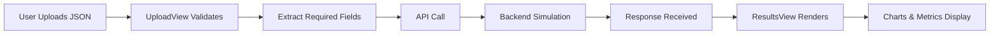

# LLMoneyMakers - Neuro-Symbolic Risk Engine

A cutting-edge credit risk assessment platform that uses **Digital Twin technology** and **Monte Carlo simulations** to evaluate lending risk by simulating how applicants would respond to various economic shocks and stress scenarios.


## 🎯 Overview

Traditional credit scoring relies on backward-looking data like credit history and static income figures. **LLMoneyMakers** takes a revolutionary approach by:

- **Creating Digital Twins** of applicants that model their financial behavior patterns
- **Simulating stress scenarios** (job loss, medical emergencies, economic downturns) to test resilience
- **Calculating survival rates** across multiple economic shocks
- **Generating AI-driven narratives** that explain risk in human-readable terms

### The Problem We Solve

Standard credit scores miss critical insights:
- A gig worker with high income volatility but strong spending flexibility might be **more resilient** than their credit score suggests
- Someone with stable income but inflexible expenses could be **more vulnerable** to shocks than traditional models indicate

Our engine uncovers these hidden patterns.

---

## 🚀 Features

### 1. **Digital Twin DNA Analysis**
Creates a behavioral model of each applicant based on:
- **Liquidity Buffer**: Months of expenses covered by savings
- **Spending Elasticity**: Ability to cut costs during tough times (0.0 - 1.0)
- **Burn Rate**: Monthly fixed expenses
- **Income Volatility**: Stability of income stream
- **Archetype Classification**: Behavioral risk profile

### 2. **Scenario Stress Testing**
Tests applicants against real-world 2026 economic scenarios:
- 🏢 Tech Hiring Freeze
- 🏠 Rent Spike (+20%)
- 💼 GenAI Gig Drought
- 📉 Urban Stagflation
- 🏥 Medical Emergency

Each scenario returns a **survival rate** (0-100%) indicating likelihood of continuing payments.

### 3. **Credit Resilience Score**
A 0-100 composite score that combines:
- Traditional bureau data (credit score, utilization, payment history)
- Digital twin resilience metrics
- Scenario survival rates

### 4. **AI Risk Narrative**
Natural language explanation of the applicant's risk profile, highlighting:
- Key strengths and vulnerabilities
- Specific scenario risks
- Lending recommendations

---

## 🏗️ Architecture

### Tech Stack

**Frontend:**
- ⚛️ **React 19.2** - UI framework
- 🎨 **Tailwind CSS 4.1** - Styling
- 📊 **Recharts 3.7** - Data visualization
- ✨ **Framer Motion 12** - Animations
- 🎯 **Lucide React** - Icon library
- ⚡ **Vite 7.3** - Build tool

**Backend API:**
- 🐍 Python-based Monte Carlo simulation engine
- 🌐 Hosted at: `https://monte-carlo-api-7y3n.onrender.com/analyze`

### Project Structure

```
credit-risk-economic-sim/
├── src/
│   ├── components/
│   │   ├── Card.jsx              # Reusable card container
│   │   ├── ProcessingView.jsx    # Loading state with terminal animation
│   │   ├── ResultsView.jsx       # Main results dashboard
│   │   ├── Stat.jsx              # Metric display component
│   │   └── UploadView.jsx        # File upload & validation
│   ├── mock_data/
│   │   └── aarav.json            # Sample applicant data
│   ├── App.jsx                   # Main app orchestration
│   ├── App.css                   # Global styles
│   ├── data.js                   # Mock API responses
│   └── main.jsx                  # React entry point
├── public/                       # Static assets
├── index.html                    # HTML template
├── package.json                  # Dependencies
├── vite.config.js               # Vite configuration
└── tailwind.config.js           # Tailwind configuration
```

---

## 📦 Installation & Setup

### Prerequisites
- **Node.js** 18+ and npm
- Modern web browser (Chrome, Firefox, Safari, Edge)

### Quick Start

1. **Clone the repository**
```bash
git clone <repository-url>
cd credit-risk-economic-sim
```

2. **Install dependencies**
```bash
npm install
```

3. **Start development server**
```bash
npm run dev
```

The app will launch at `http://localhost:5173`

### Available Scripts

- `npm run dev` - Start development server with hot reload
- `npm run build` - Build production bundle
- `npm run preview` - Preview production build
- `npm run lint` - Run ESLint code quality checks

---

## 📡 API Integration

### Endpoint
```
POST https://monte-carlo-api-7y3n.onrender.com/analyze
```

### Request Payload

The API expects applicant data in this format:

```json
{
  "application_id": "APP_8821_BLR",
  "applicant_details": {
    "name": "Aarav Sharma",
    "age": 24,
    "city_tier": "Tier_1",
    "job_title": "Freelance Full-Stack Developer",
    "stated_monthly_income": 100000,
    "housing_status": "Renting_Shared",
    "education": "B.Tech_Tier_2"
  },
  "bureau_data": {
    "credit_score": 680,
    "total_revolving_limit": 200000,
    "current_revolving_balance": 140000,
    "utilization_ratio": 0.70,
    "total_monthly_emi_obligations": 0,
    "payment_history": {
      "avg_payment_amount": 140000,
      "payment_type": "Transactor"
    },
    "account_age_years": 2
  }
}
```

**Important:** Do NOT include `simulation_results` in the request payload - that's generated by the backend.

### Response Format

```json
{
  "application_id": "APP_8821_BLR",
  "name": "Aarav Sharma",
  "score": 99,
  "status": "APPROVED",
  "twin_profile": {
    "liquidity_buffer": 6.1,
    "spending_elasticity": 0.85,
    "burn_rate": 18000.0,
    "income_volatility": "High (0.35)",
    "archetype": "High Volatility / High Resilience"
  },
  "scenarios": [
    {
      "name": "Tech Hiring Freeze",
      "survival": 100
    },
    {
      "name": "Rent Spike (+20%)",
      "survival": 100
    }
  ],
  "ai_narrative": "Applicant shows strong resilience..."
}
```

---

## 🎮 Usage Guide

### Option 1: Upload JSON File

1. Click the upload zone or drag & drop a JSON file
2. File must contain valid applicant and bureau data structure
3. The app validates the structure and sends to API
4. Results appear after ~5 seconds of processing

### Option 2: Use Demo Profiles

Two pre-configured profiles are available:

**🟢 Aarav (Resilient)**
- Gig worker with high income volatility
- Strong spending flexibility (0.85 elasticity)
- Good liquidity buffer (6+ months)
- **Expected:** APPROVED with high score

**🔴 Vikram (Risky)**
- Extreme income volatility
- Inflexible spending (0.25 elasticity)
- Low liquidity buffer (1.2 months)
- **Expected:** REJECTED with low score

---

## 🧩 Component Breakdown

### `App.jsx` - Main Orchestrator
- Manages view state (`upload` → `processing` → `results`)
- Handles API calls with error handling
- Normalizes API responses for frontend consumption
- Controls data flow between components

### `UploadView.jsx` - Input Interface
- Drag-and-drop file upload
- JSON validation (schema checking)
- Constructs API payload (excludes mock-only fields)
- Demo profile buttons

### `ProcessingView.jsx` - Loading State
- Animated CPU icon
- Terminal-style message ticker
- Creates anticipation during API call

### `ResultsView.jsx` - Dashboard
- **Panel A:** Digital Twin DNA metrics
- **Panel B:** Credit Resilience Score & Status
- **Panel C:** Scenario survival rate chart (interactive bar graph)
- **Panel D:** AI narrative with typewriter effect

---

## 📊 Data Flow



**Key Transformations:**
1. Frontend sends only: `application_id`, `applicant_details`, `bureau_data`
2. Backend adds: `twin_profile`, `scenarios`, `score`, `status`, `ai_narrative`
3. Frontend maps `survival` → `survival_rate` for chart compatibility

---

## 🎨 Design Philosophy

### Visual Aesthetics
- **Dark Mode First:** Slate-950 background with blue/purple accents
- **Glassmorphism:** Translucent cards with backdrop blur
- **Data Visualization:** Color-coded metrics (green = safe, red = risk)
- **Micro-animations:** Smooth transitions and hover effects

### UX Principles
- **Progressive Disclosure:** Upload → Processing → Results flow
- **Immediate Feedback:** Real-time validation errors
- **Contextual Help:** Visual indicators and tooltips
- **Accessibility:** Semantic HTML and ARIA labels

---

## 🔧 Configuration

### Environment Variables
None required for basic operation. API endpoint is hardcoded but can be moved to `.env`:

```bash
VITE_API_URL=https://monte-carlo-api-7y3n.onrender.com
```

Then update `App.jsx`:
```javascript
const API_URL = import.meta.env.VITE_API_URL || 'https://monte-carlo-api-7y3n.onrender.com';
```

---

## 🐛 Troubleshooting

### Graphs Not Displaying
**Issue:** API returns `survival` but graph expects `survival_rate`

**Solution:** Already handled via data normalization in `App.jsx`. If still failing, check browser console for data structure.

### API Timeout
**Issue:** Backend cold start on Render.com can take 30-60 seconds

**Solution:** Increase timeout or add retry logic:
```javascript
const controller = new AbortController();
const timeoutId = setTimeout(() => controller.abort(), 60000); // 60s timeout
```

### File Validation Errors
**Issue:** JSON structure doesn't match expected schema

**Solution:** Ensure your JSON includes all required fields:
- `application_id` (string)
- `applicant_details` (object with `name`, `age`, `city_tier`)
- `bureau_data` (object)

---

## 🚢 Deployment

### Build for Production
```bash
npm run build
```
Output: `dist/` folder

### Deploy Options
- **Vercel:** `vercel --prod`
- **Netlify:** Drag & drop `dist/` folder
- **GitHub Pages:** Use `gh-pages` package
- **AWS S3 + CloudFront:** Static hosting

---

## 🤝 Contributing

Contributions welcome! Focus areas:
- Additional scenario types
- Enhanced visualizations
- Mobile responsive improvements
- Accessibility enhancements

---

## 📄 License

MIT License - feel free to use for hackathons, demos, or production.

---

## 👥 Team

**LLMoneyMakers** - Team Members:
- [Your Name] - Frontend Development
- [Backend Team] - Monte Carlo Engine

---

## 📞 Support

For issues or questions:
- Open a GitHub issue
- Contact: [your-email@example.com]

---

**Built with ❤️ for the Credit Risk Innovation Hackathon**
